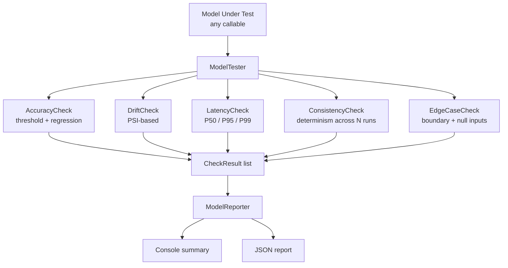

# AI Model Testing Framework


A **production-style ML model quality framework** that gates model deployments
on accuracy, data drift, latency, prediction consistency, and edge case handling.

Built as a portfolio project to demonstrate how to apply SDET discipline to
machine learning — treating models as testable software components with explicit
quality contracts.

---

## Problem This Solves

ML models fail differently from traditional software. They don't throw exceptions —
they silently degrade. This framework catches:

| Failure Mode | What Happens | Check |
|---|---|---|
| Accuracy regression | New model version is less accurate | `AccuracyCheck` |
| Data distribution shift | Production data looks different from training | `DriftCheck (PSI)` |
| Latency spike | Model inference exceeds SLA threshold | `LatencyCheck (P99)` |
| Non-determinism | Same input gives different output across runs | `ConsistencyCheck` |
| Edge case crash | Model fails on nulls, extremes, or empty inputs | `EdgeCaseCheck` |
| Version regression | v2.0 worse than v1.0 on same test set | `RegressionCheck` |

---

## Architecture



---

## Folder Structure

```
ai-model-testing-framework/
├── .github/workflows/ci.yml
├── docs/
│   ├── interview-notes.md
│   └── resume-bullets.md
├── src/
│   ├── models/
│   │   └── model_interface.py   # Protocol + PerfectModel, NoisyModel, SlowModel mocks
│   ├── checks/
│   │   ├── accuracy.py          # accuracy_score, regression threshold
│   │   ├── drift.py             # Population Stability Index (PSI)
│   │   ├── latency.py           # P50/P95/P99 with configurable thresholds
│   │   ├── consistency.py       # N-run determinism check
│   │   └── edge_cases.py        # Declarative edge case test runner
│   └── reporter/
│       └── model_reporter.py    # Aggregates results → console + JSON
├── tests/
│   ├── conftest.py
│   ├── test_accuracy.py         # 12 tests
│   ├── test_drift.py            # 10 tests
│   ├── test_latency.py          # 10 tests
│   ├── test_consistency.py      # 10 tests
│   ├── test_edge_cases.py       # 10 tests
│   └── test_reporter.py         # 10 tests
└── requirements.txt
```

---

## Setup

```bash
git clone https://github.com/guruambati/ai-model-testing-framework.git
cd ai-model-testing-framework
python -m venv venv
source venv/bin/activate
pip install -r requirements.txt
```

---

## Run Tests

```bash
pytest
pytest --cov=src --cov-report=term-missing
pytest tests/test_drift.py -v
```

---

## Quick Example

```python
from src.models.model_interface import PerfectBinaryModel
from src.checks.accuracy import AccuracyCheck
from src.checks.drift import DriftCheck
from src.checks.latency import LatencyCheck
from src.reporter.model_reporter import ModelReporter

model   = PerfectBinaryModel()
X_test  = list(range(20))
y_test  = [x % 2 for x in X_test]

results = [
    AccuracyCheck(threshold=0.90).run(model.predict, X_test, y_test),
    AccuracyCheck(threshold=0.85).run_regression(
        model.predict, X_test, y_test, baseline_accuracy=0.88, tolerance=0.02
    ),
    DriftCheck(threshold=0.1).run(
        reference=list(range(100)), production=list(range(5, 105))
    ),
    LatencyCheck(p99_threshold_ms=500).run(model.predict, X_test[:10]),
]

reporter = ModelReporter(results, model_name="BinaryClassifier-v2.0")
reporter.print_summary()
reporter.save_json("reports/run.json")
```

---

## Sample Test Output

```
tests/test_accuracy.py::TestAccuracy::test_perfect_model_passes          PASSED
tests/test_accuracy.py::TestAccuracy::test_bad_model_fails               PASSED
tests/test_drift.py::TestDrift::test_same_distribution_no_drift          PASSED
tests/test_drift.py::TestDrift::test_different_distribution_drift        PASSED
tests/test_latency.py::TestLatency::test_fast_model_p99_passes           PASSED
tests/test_consistency.py::TestConsistency::test_deterministic_passes    PASSED
tests/test_edge_cases.py::TestEdgeCases::test_null_input_handled         PASSED

========== 62 passed in 1.14s ==========
```

---

## Tech Stack

Python 3.11 · pytest · dataclasses · statistics · math · GitHub Actions CI

No ML framework required for the framework itself — works with any callable model.
sklearn is an optional dev dependency for integration examples.

---

## Resume Bullets

See [`docs/resume-bullets.md`](docs/resume-bullets.md)

## Interview Notes

See [`docs/interview-notes.md`](docs/interview-notes.md)
